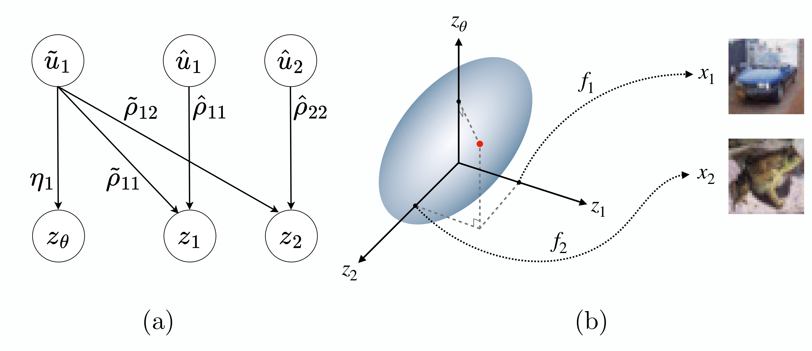

<div align="center">

# Multimodal Datasets with Controllable Mutual Information

[](https://arxiv.org/abs/2510.21686)


</div>

We introduce a framework for generating highly multimodal datasets with explicitly calculable mutual information between modalities. This enables the construction of benchmark datasets that provide a novel testbed for systematic studies of mutual information estimators and multimodal self-supervised learning techniques. Our framework constructs realistic datasets with known mutual information using a flow-based generative model and a structured causal framework for generating correlated latent variables.


<div align="center">



</div>

**Figure 1. Schematic of our dataset generation framework.** (a) An example DAG showing the linear mixing of proto-latents **u** via coefficients **η**, **ρ** into interpretable correlated Gaussian latent variables **z**. (b) Overview of sampling from a multidimensional Gaussian to draw latent inputs *z₁*, *z₂*, and *zθ* that are fed into invertible maps *f₁* and *f₂* to a realistic feature space.

This is the official implementation for our [paper](https://arxiv.org/abs/2510.21686), providing scripts for reproducing paper results as well as a general plug-and-play framework for producing your own datasets.

## To install dependencies

Copy the relevant files from the [environments](environments) directory, i.e. [environment.yml](environments/environment.yml) for Conda and pixi.* files for Pixi.

If you use Conda:
```bash
conda env create -f environment.yml
conda activate flow_matching
```
Note: If you are setting this on a computer without CUDA, replace `pytorch-gpu` with `pytorch`.

If you use Pixi:
```bash
pixi init
pixi run download
pixi install
```

If you want to use a pre-compiled [Docker container](https://hub.docker.com/r/rkhashmani/mutual_info_flow_matching/tags):
```bash
docker pull rkhashmani/mutual_info_flow_matching:1.0.0
```

For instructions on building a Docker container, please see the relevant [README](environments/docker/README.md) file.

## Training a Flow Matching Model
We use a CIFAR10-trained flow matching model in our work to produce realistic images with controlled mutual information. To train your own flow matching model, run the following command:
```python
python train/train.py \
--dataset=cifar10 \
--batch_size=64 \
--accum_iter=1 \
--eval_frequency=100 \
--epochs=3000 \
--cfg_scale=0.2 \
--compute_fid \
--ode_method heun2 \
--ode_options '{"nfe": 50}' \
--use_ema \
--edm_schedule \
--skewed_timesteps
```

## Generating Datasets with Controllable Mutual Information
Once you have a trained flow matching model (or other bijective information-preserving transform), generate datasets using

```bash
python dataset_generation.py @generation_arguments.txt
```

You can also add individual arguments to update things on the fly (useful for HTCondor)

```bash
python dataset_generation.py @generation_arguments.txt --job_id 0
```

Possible arguments include dataset size, number of correlated images, batch size, covariance matrices, labels wanted, and more. The full list can be found in [generation_arg_parser.py](dataset_generation/generation_arg_parser.py). Arguments used for our paper can be found in the [generation arguments](generation_arguments/) directory.
